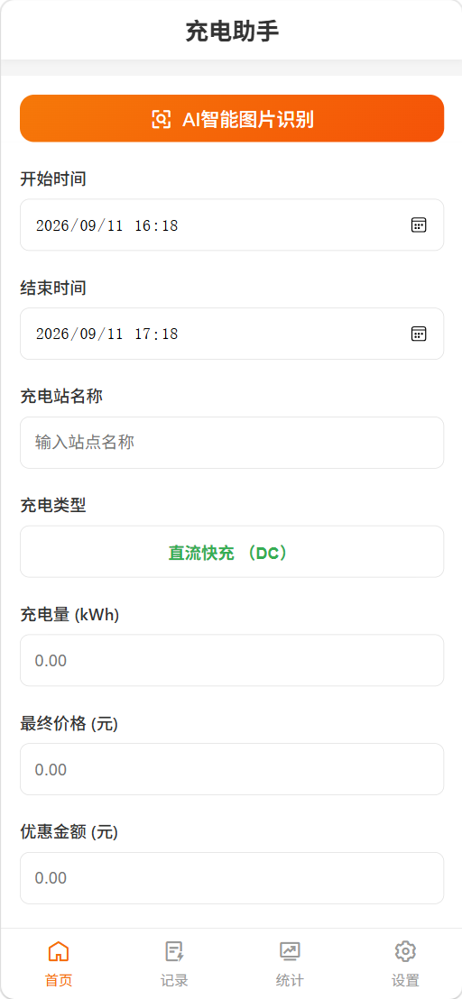
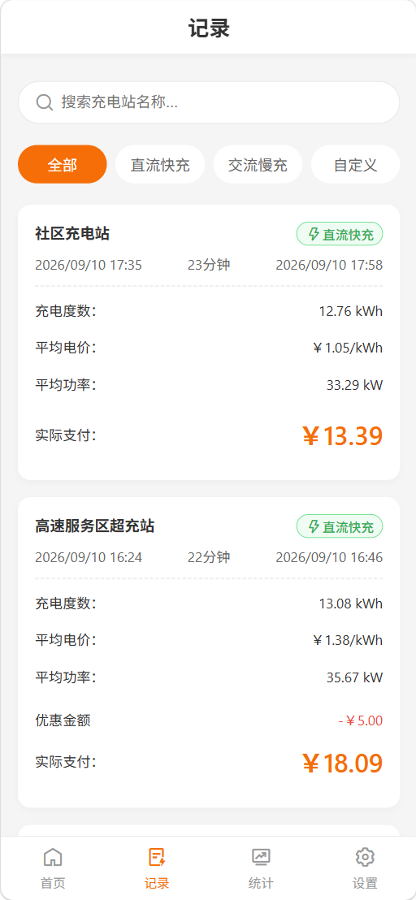
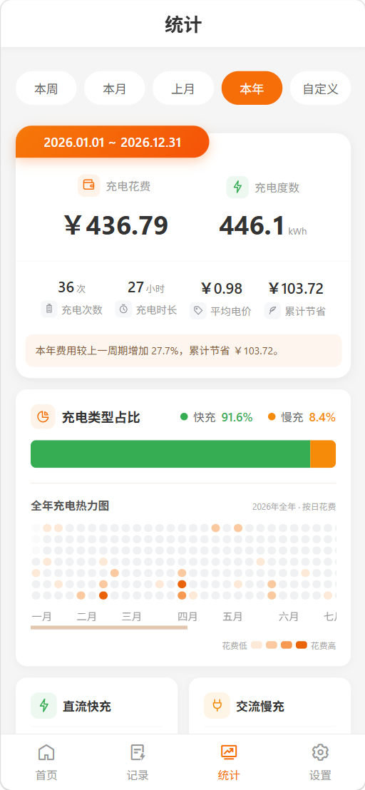
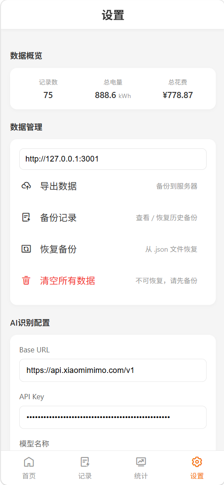

# Charging · 充电助手

<p align="center">
  
</p>

<p align="center">面向新能源汽车车主的本地化充电记录、统计与账单识别工具</p>

<p align="center">
  
  
  
</p>

## 简介

充电助手用于集中管理每一次车辆充电：记录电量、实际支付、优惠、充电时段和充电站，并在本地生成费用、电价、功率与使用习惯分析。核心数据默认保存在当前设备浏览器中；需要迁移或备份时，可导出 JSON 文件，或连接可选的局域网备份服务。

项目采用原生 HTML、CSS 和 JavaScript 实现，不依赖前端构建工具，适合直接在浏览器、PWA 容器或 HBuilder X 中运行。

## 界面预览

| 首页录入与 AI 识别 | 记录管理页面 |
| --- | --- |
|  |  |
| **数据统计页面** | **设置与备份页面** |
|  |  |

## V1.1 功能概览

| 模块 | 能力 |
| --- | --- |
| 记录录入 | 手动填写、快充/慢充切换、站点自动补全、平均功率自动计算 |
| AI 图片识别 | 从充电账单截图提取时间、站点、类型、电量、金额和优惠 |
| 记录管理 | 搜索、类型筛选、自定义日期筛选、分页、长按编辑或删除 |
| 周期统计 | 本周、本月、上月、本年与自定义区间统计 |
| 数据可视化 | 快慢充占比、快慢充明细、全年充电费用热力图 |
| 深度分析 | 充电之最、充电站排行榜，以及一键定位至对应记录 |
| 数据保护 | JSON 导入导出、可选局域网备份、历史备份管理 |
| 使用体验 | PWA 离线缓存、底部导航双击回顶、移动端紧凑统计布局 |

## 主要功能

### 1. 充电记录

- 记录开始/结束时间、充电站、快充或慢充、电量、实际支付金额和优惠金额。
- 自动计算单次平均功率：`充电电量 ÷ 充电时长`。
- 自动展示单次平均电价、充电时长与优惠金额。
- 保存时会识别业务字段相同的重复记录；若发现重复，会直接定位到已存在的记录。
- 站点名称支持历史记录自动补全。
- 长按记录卡片可编辑或删除；编辑窗口会正确加载原始开始和结束时间。

### 2. AI 智能图片识别

在设置页保存兼容视觉模型的 API 地址、API Key 和模型名称后，可在首页选择充电账单截图并自动填充表单。

- 识别字段：开始时间、结束时间、充电站、充电类型、电量、实际支付金额、优惠金额。
- 优先依据“直流 / DC / 快充 / 超充”或“交流 / AC / 慢充”等文字判断充电类型。
- 当截图只有“月/日”而未识别到年份时，自动补充为当前年份，避免记录被错误归入旧年份。
- 若结束时间未带年份且早于开始时间，会按跨天记录处理。
- 识别结果仍需用户确认后再保存；截图清晰度、账单样式和模型能力都会影响准确率。

### 3. 记录页与分页

- 支持按站点名称实时搜索。
- 支持“全部、直流快充、交流慢充、自定义时间”筛选。
- 自定义时间提供上月、本月、今年快捷选择。
- 每页展示 20 条记录，支持上一页/下一页。
- 翻页不会主动滚到新页首条记录；页面按当前分页栏位置直接切换。
- 从统计页点击“充电之最”或充电站排行榜后，会自动清除不相关筛选、切至目标页并定位高亮对应记录。

### 4. 统计与可视化

顶部时间范围可选择本周、本月、上月、本年或自定义区间。统计按记录开始时间归属周期，跨越周期边界的充电不会被遗漏。

- 总费用、总电量、充电次数、充电时长、平均电价和累计节省。
- 快充/慢充电量占比。
- 快充与慢充的电量、费用、均价和精确时长。
- 全年充电费用热力图：颜色越深代表当日实际支付费用越高。
- 充电站排行榜：最常用、最省钱、充得快三个维度。最省钱按优惠前单价计算，即 `(实际支付 + 优惠金额) ÷ 电量`。

### 5. 充电之最

“充电之最”仅根据当前统计周期内的记录计算，所有小卡片均可点击定位至原始记录：

1. 费用最高
2. 费用最低
3. 优惠最多
4. 时长最长
5. 功率最高
6. 功率最低
7. 单价最高
8. 单价最低

单价最高和最低均按优惠前单价计算；费用最高和最低则按实际支付金额计算。移动端使用两列紧凑卡片，站点名称与日期分两行显示，长站名会自动省略。

### 6. 数据与备份

- 日常记录、时间范围和 AI 配置保存在浏览器 `localStorage`。
- 未配置备份服务器时，可直接导出完整 JSON 数据文件；服务器备份连接或响应失败时也会自动回退为本地下载。
- 可从 JSON 文件恢复记录。
- 导入和本地缓存加载时会校验时间、数值、充电类型和必填字段，异常记录不会参与统计。
- 可选局域网备份服务支持上传、查看、下载、恢复和删除历史备份。
- 服务端按浏览器生成的用户 ID 分目录保存，单个用户默认最多保留 30 份备份。

> 提示：浏览器清理站点数据或更换设备前，请先导出 JSON 或完成备份。API Key 同样存储在本机浏览器中，请不要在公共设备上保存敏感密钥。

## 快速开始

### 仅运行前端

本项目是静态网页。推荐通过本地 HTTP 服务启动，以便 Service Worker 与离线缓存正常工作：

```bash
cd Charging
python -m http.server 4173
```

然后访问 `http://localhost:4173`。也可以用 HBuilder X 打开项目并运行到浏览器或真机。

### 启动可选备份服务

备份服务仅在需要局域网备份时启动，运行环境为 Node.js 14 或更高版本，无第三方依赖。

```bash
cd Charging/backend
npm start
```

默认监听 `0.0.0.0:3001`。在应用设置中填写服务器地址，例如：

```text
http://192.168.1.100:3001
```

手机使用时，请确保手机与运行服务的电脑位于同一局域网，且防火墙已允许该端口访问。

### AI 识别配置

1. 打开设置页，填写 API 地址、API Key 与模型名称。
2. 确认所选模型支持图片输入（Vision）。
3. 回到首页，点击“AI 智能图片识别”，选择或拍摄账单截图。
4. 检查自动填充的字段，确认无误后保存。

## 数据格式

导出的文件为 JSON，当前导出格式版本为 `2.0`。`discountAmount` 为空时会按 `0` 处理。

```json
{
  "version": "2.0",
  "exportDate": "2026-09-11T12:00:00.000Z",
  "records": [
    {
      "id": "1720000000000",
      "stationName": "示例充电站",
      "chargeType": "fast",
      "startTime": "2026-09-10T10:00:00.000Z",
      "endTime": "2026-09-10T11:15:00.000Z",
      "chargeAmount": 45.5,
      "finalPrice": 58.25,
      "discountAmount": 5.0
    }
  ]
}
```

| 字段 | 类型 | 说明 |
| --- | --- | --- |
| `id` | string | 记录唯一标识 |
| `stationName` | string | 充电站名称 |
| `chargeType` | string | `fast` 为直流快充，`slow` 为交流慢充 |
| `startTime` / `endTime` | ISO 8601 string | 充电开始与结束时间 |
| `chargeAmount` | number | 充电电量，单位 kWh，必须大于 0 |
| `finalPrice` | number | 实际支付金额，单位元 |
| `discountAmount` | number | 优惠金额，单位元，可为 0 |

## 项目结构

```text
Charging/
├── index.html              # 页面结构与统计卡片
├── css/main.css            # 响应式样式
├── js/
│   ├── app.js              # 事件、表单、导航、备份与弹窗
│   ├── data.js             # 本地数据、导入导出与统计基础数据
│   ├── ui.js               # 列表、分页、统计页渲染与定位
│   ├── analytics.js        # 热力图、排行榜等分析计算
│   ├── ai.js               # AI 图片识别请求与结果规整
│   └── utils.js            # 格式化、校验与公共工具
├── backend/
│   ├── server.js           # 可选局域网备份服务
│   └── backups/            # 备份文件目录（运行时创建）
├── manifest.json           # HBuilder App 清单
└── sw.js                   # Service Worker 离线缓存
```

## 备份服务接口

基础地址：`http://<服务器IP>:3001`。所有请求通过 `uid` 参数隔离用户数据。

| 方法 | 路径 | 用途 |
| --- | --- | --- |
| `POST` | `/api/backup?uid={uid}` | 创建备份 |
| `GET` | `/api/backups?uid={uid}` | 获取备份列表 |
| `GET` | `/api/download/{fileName}?uid={uid}` | 下载备份文件 |
| `GET` | `/api/content/{fileName}?uid={uid}` | 读取备份内容用于恢复 |
| `DELETE` | `/api/backups/{fileName}?uid={uid}` | 删除备份 |

创建备份请求示例：

```json
{
  "content": "{\"version\":\"2.0\",\"records\":[...]}",
  "fileName": "charging_backup_2026-09-11.json"
}
```

## 更新日志

### V1.1.0

- 新增单次与统计周期平均功率计算。
- 新增充电费用热力图、充电站排行榜及“充电之最”分析。
- 新增费用最低、优惠最多、单价最高、单价最低等分析指标。
- 新增从统计卡片和排行榜一键定位至原始记录。
- 新增记录自定义时间的上月、本月、今年快捷选择。
- 修复 AI 识别缺少年份时被错误写入旧年份的问题。

### V1.0.0

- 首次发布：充电记录、基础统计、AI 账单识别、数据导入导出与可选备份服务。

## 许可与作者

- License: MIT
- Author: 小枫社长
